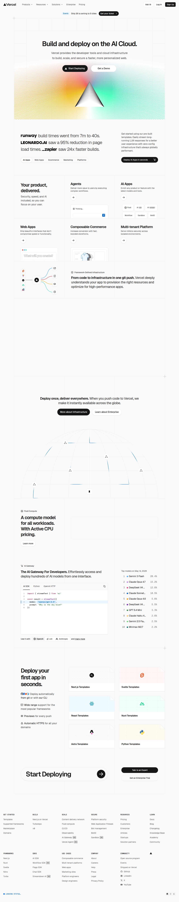
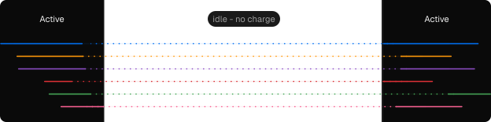
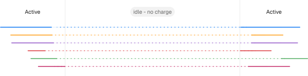

# Visited: https://vercel.com
**Time:** Thu May 14 16:46:36 UTC 2026

## Favicon

## Screenshot

## Raw HTML
[page.html](./page.html)

## Downloaded Media (27 files)
## Downloaded Media Files

- [1778777195_favicon.ico](./media/1778777195_favicon.ico) (14 KB)

## Other Links
- [#geist-skip-nav](#geist-skip-nav)
- [${a}](${a})
- [/about](/about)
- [/academy](/academy)
- [/agent](/agent)
- [/agents](/agents)
- [/ai](/ai)
- [/ai-gateway](/ai-gateway)
- [/ai-gateway/models](/ai-gateway/models)
- [/ai-sdk](/ai-sdk)
- [/blog](/blog)
- [/botid](/botid)
- [/careers](/careers)
- [/cdn](/cdn)
- [/changelog](/changelog)
- [/contact/sales](/contact/sales)
- [/contact/sales/demo](/contact/sales/demo)
- [/contact/sales/enterprise-trial](/contact/sales/enterprise-trial)
- [/customers](/customers)
- [/docs](/docs)
- [/docs/frameworks](/docs/frameworks)
- [/docs/frameworks/backend/nitro](/docs/frameworks/backend/nitro)
- [/docs/frameworks/full-stack/nuxt](/docs/frameworks/full-stack/nuxt)
- [/docs/frameworks/full-stack/sveltekit](/docs/frameworks/full-stack/sveltekit)
- [/domains](/domains)
- [/enterprise](/enterprise)
- [/events](/events)
- [/fluid](/fluid)
- [/frameworks/nextjs](/frameworks/nextjs)
- [/help](/help)
- [/home](/home)
- [/i](/i)
- [/kb](/kb)
- [/legal](/legal)
- [/legal/privacy-policy](/legal/privacy-policy)
- [/login](/login)
- [/manifest.webmanifest](/manifest.webmanifest)
- [/marketplace](/marketplace)
- [/new](/new)
- [/open-source-program](/open-source-program)
- [/partners/solution-partners](/partners/solution-partners)
- [/press](/press)
- [/pricing](/pricing)
- [/products/managed-infrastructure](/products/managed-infrastructure)
- [/products/observability](/products/observability)
- [/products/previews](/products/previews)
- [/sandbox](/sandbox)
- [/security](/security)
- [/security/bot-management](/security/bot-management)
- [/security/web-application-firewall](/security/web-application-firewall)

## Stats
- Links: 198
- Media: 27
